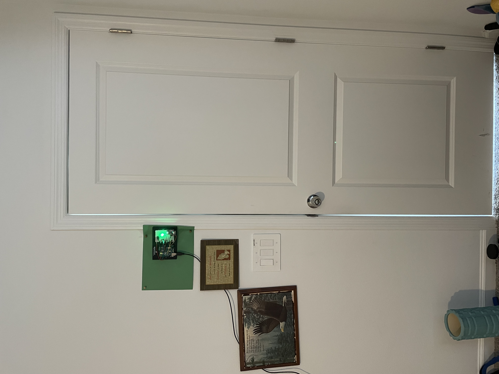

# In_Home_Motion_Alarm
A simple in-home motion alarm security system that detects movement
/

(1) IDEATION & PREP
The initial motivation for creating this stemmed from a need. I had just moved into a new place and noticed that security could be improved. I have experience with motion sensors, hardware, and software, so rather than going out and buying a brand new home security system, i figured, "Why not try and build my own?" I first started by dragging out what i saw in my head into reality through sketching. I tend to get stuck in analysis paralysis so instead of making a comprehensive list of every single thing i'd need, I just made a short list of the bare minimum equipment i'd need to get a prototype up & going.

(2) PROCESS
For this project i relied heavily on the Sparkfun Inventor's Kit Experiemnet Guide (Circuit 3C: Motion Alarm). I convigured the code so that it was more of "latch" system rather than a standard motion alarm. So instead of the alarm only sounding when something was in range, the moment something triggered the alarm it would alert indefinitely until manually reset. This was for in the event someone closed the door to try and pretend they weren't there. Once the main software and hardware was setup it was time to mount the circuit to the wall.

(3) END RESULT & PROJECT SO FAR

